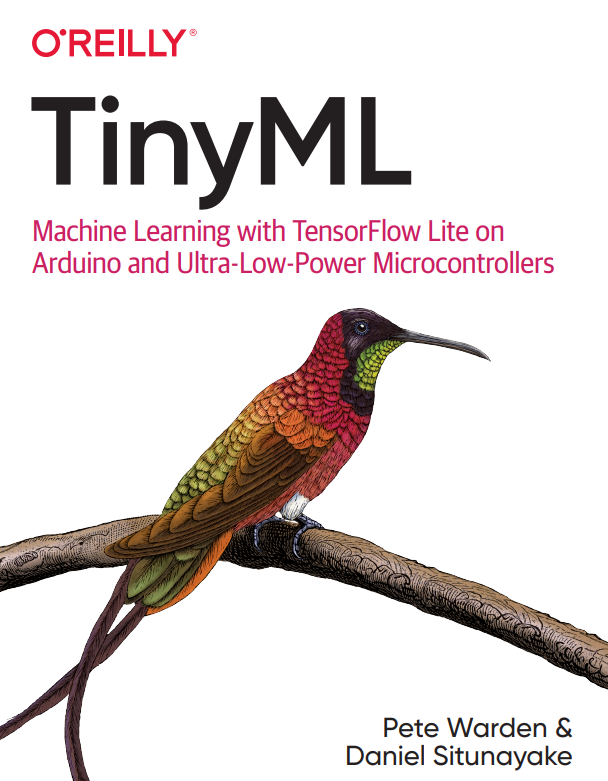

# TensorFlow
El curso estará fundamentado en la perspectiva de uso de sistemas de ML, en microcontroladores así pues tomando como referencia el libro ***Machine Learning with TensorFlow Lite on Arduino and Ultra-Low-Power Microcontrollers*** de Pete Warden & Daniel Situnayake. 

 

# Descripción
Este nos permitira tener un primer acercamiento a las estructuras de inferencia establecidas en los microcontroladores, viendo como por medio de algoritmos de optimización se realiza la migración de modelos estandar a modelos de inferencia móvil.

## Actividad
Realiza la actividad planteada en train_hello_world_model en la carpeta de **Modules*** variando los parámetros de red y estableciendo de manera comparativa los tamaños y perdida de cada red.

