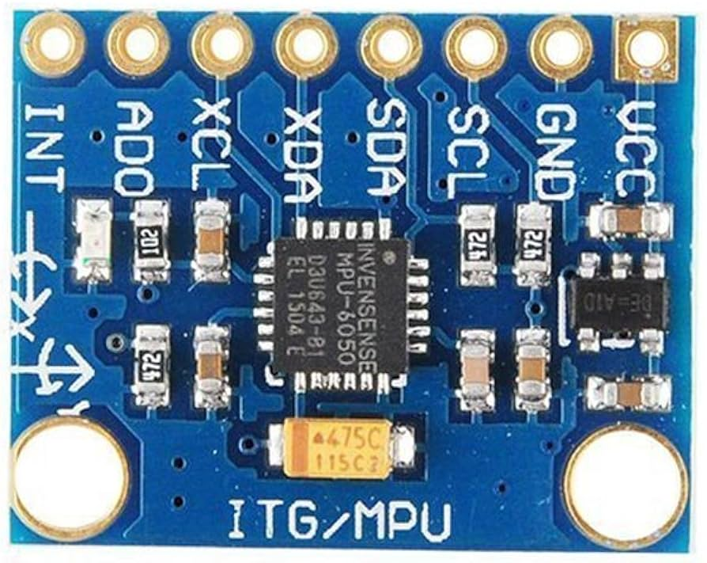
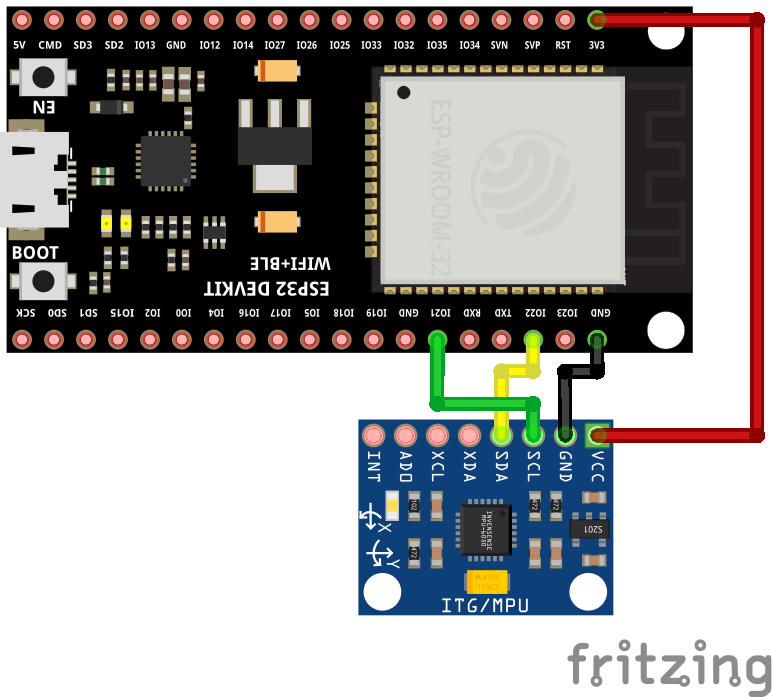
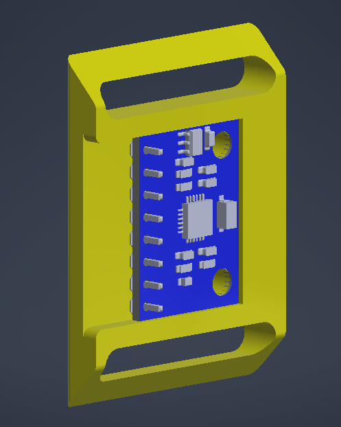

# Adquisición de Datos

Para el proyecto se dispone la evaluación de gestos basado en la posible interpretación de ya sea lenguaje de señas o movimientos naturales asociados a un cambio en las aceleraciones de la mano o el cuerpo. Para esto usaremos un sensor acelerometro del tipo MPU6050, visto a continuación:
<center>
</center> 

Este por medio del protocolo $i^{2}C$ se comunicara con nuestro microcontrolador ESP32, por medio de las siguientes conexiones:
<center>
</center> 

- Esta configuración puede cambiar dependiendo de la distribución de la tarjeta usada.
(revisar conexiones GND - ground y VCC - 3.3v)

# Recolección

Para recolectar los datos asociados se puede hacer uso del archivo presente en la carpeta de Arduino llamado imu_collector.ino, de igual manera puede correrlo en platformIO, agregando las siguientes dependencias a su archivo .ini:

```
lib_deps = https://github.com/adafruit/Adafruit_BusIO.git
           https://github.com/adafruit/Adafruit_MPU6050.git
           https://github.com/adafruit/Adafruit_Sensor.git
```

Para la lectura correcta de los datos, para esto no abra la consola ni de platformIO, ni de ArduinoIDE (ya que esto bloqueara la comunicación serial).
- Ahora para realizar esta lectura abra y corra el archivo en la carpeta de Python llamada ***data_collector.py***, este se encargara de leer los datos del sensor y guardarlos en un archivo ***.csv***, desde el momento de su activación.

Esto le guardara un archivo con el siguiente encabezado:
```
'Accel x (m/s^2)', 'Accel y (m/s^2)', 'Accel z (m/s^2)', 'w_x (rad/s)', 'w_y (rad/s)', 'w_z (rad/s)', 'Temp (°C)'
```
Recuerde que estos datos son vitales para el reconocimiento de gestos por parte del brazo para eso se recomienda usar un modelo como soporte para el brazo o en forma de pulsera como se enseña a continuación:
<center>
</center> 

## Experimentación

Ahora se le solicita que grabe dos o más gestos de su agrado para ser reconocidos, donde será de vital importancia que tenga en cuenta la frecuencia de muestreo dada por
$$
f = \frac{1}{T_{s}}
$$
Donde $T_{s}$ es el valor de la espera en bucle y estará dada por $\frac{x}{1000}$ ya que el delay esta dado en $\mu s$. 

## Evaluación

Una vez tomados estos datos realice la evaluación de los mismos con los siguientes pasos.
